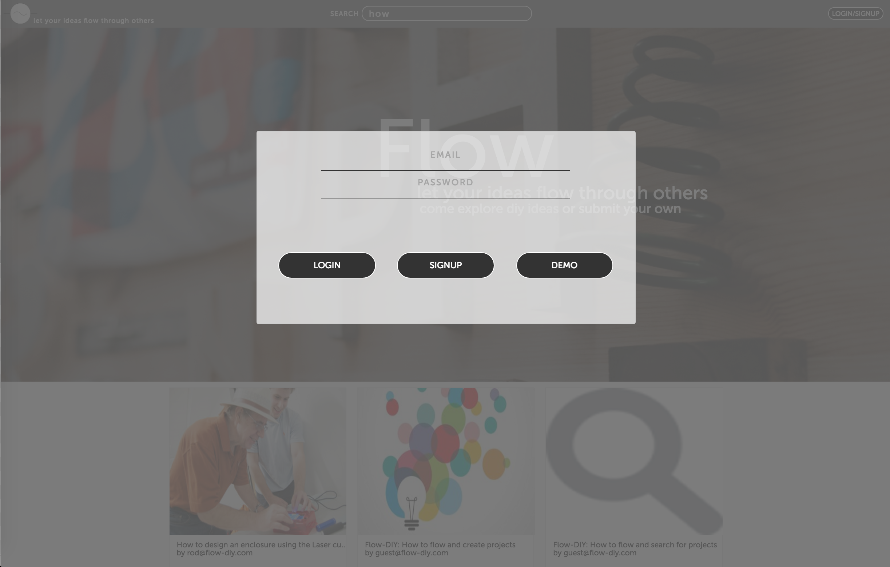

# [Flow-DIY](http://flow-diy.herokuapp.com/#/?_k=26xez4)

Flow-DIY is a web application influenced by [Instructables](instructables.com) built on Ruby-on-Rails and React that will focus on hosting do it yourself (diy) projects. Visitors will be able to explore other ideas and/or create their own projects online for others to try out!

## Application Features

#### Dynamic filtering allows users to search through Flow's database instantaneously

#### Single page application with authentication and instant error handling to provide a smooth user experience

#### Minimalistic project layouts so users can focus on what matters, the data!

#### Minimalistic project creation pages. Add as many pictures as you want to each of your steps. The more, the better!

## Technical Features

###Stack
* Ruby on Rails
* React.js
* Postgresql

###Models Schema
* Users
* Projects
* Steps
* Images

###APIs
* Cloudinary API

###Modularized Components
React components are abstract data objects that are grouped in a parental hierarchy through which content is managed and displayed. This enables easy code maintainability and permits iterative development and design.

###Data Integrity
Through React and implementing a flux architecture, data is provided in real time, allowing dynamic updates and reducing' server requests.

## Todos/Future Features
* refactor image carousel to display personalized pictures based on user favorite projects
* add comment and favorite features so that visitors can better interact with each other
* add the ability to change the project picture/video
* set up browsing history in localStorage to further improve navigation
* add user profile interactive functionality
